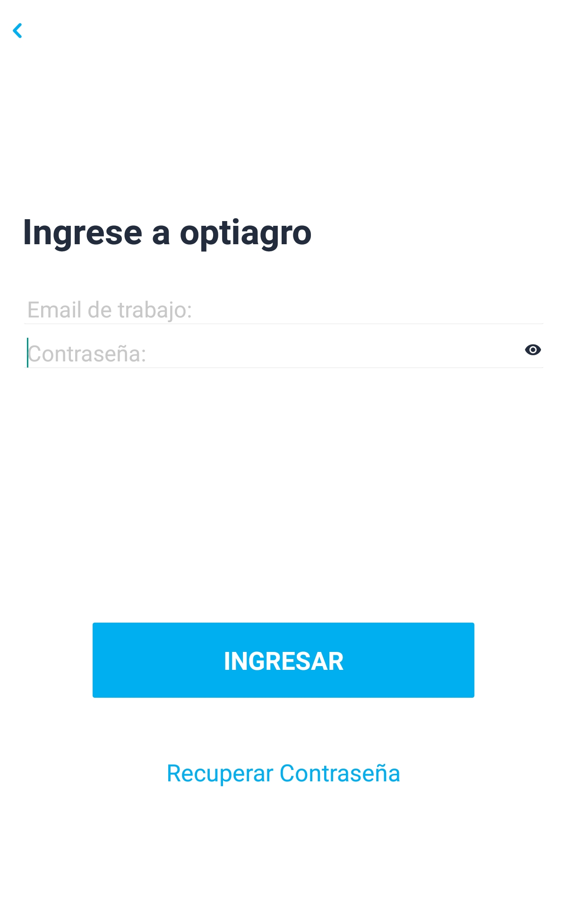
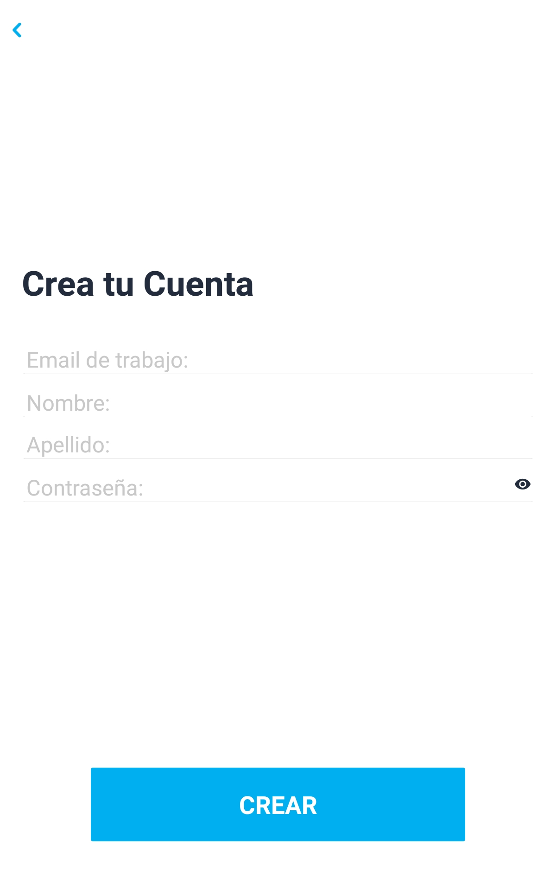
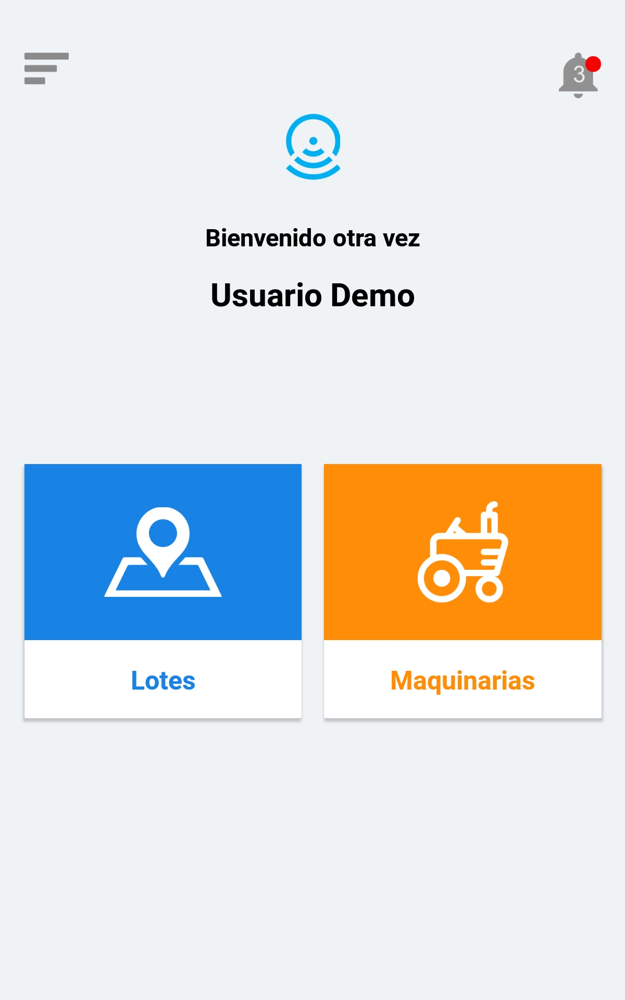
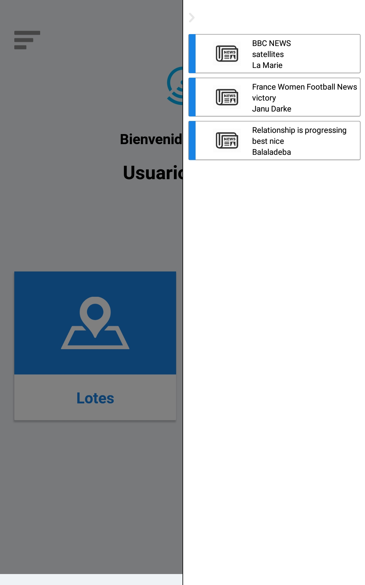

<h1 align="center"><b> Farm Management App</b> </h1>

<h1 align="center">
   
  <kbd>
    
  </kbd>
   
    
</h1>

The most Cost Effective Farm management and accounting APP on the market for 2019. Smart Farming Software's Farm Manager Pro - The Farming App which puts Farm Data Management and Farm Accounting /Finance records in your Pocket 24/7 for when you need them to make data driven farm management decisions

<i>"How to save a life?" - The Farm Management</i> 

  
  
  
  

  <a href="#blush-overview">Overview</a> •
  <a href="#dizzy-roadmap">Roadmap</a> •
  <a href="#wrench-install-instructions">Install</a> •
  <a href="#zap-tech-stack">Tech Stack</a> •
  <a href="#iphone-Test">Test</a> •
  <a href="#eyes-version">Version</a> •

  <kbd>
    
  </kbd>
  &nbsp;&nbsp;&nbsp;&nbsp;
  <kbd>
    
  </kbd>
  &nbsp;&nbsp;&nbsp;&nbsp;
  <kbd>
    
  </kbd>
    
  <kbd>
    
  </kbd>
    &nbsp;&nbsp;&nbsp;&nbsp;
  <kbd>
    
  </kbd>
    &nbsp;&nbsp;&nbsp;&nbsp;
  <kbd>
    
  </kbd>

## :blush: **Overview?**

This All in One Farm Management App is packed with features to help you manage all your farm from Farm Finance Management to Animals Management (Dairy, Beef Drystock, Sheep, Pigs, Horses, even your dogs), Crops management, Fields, Animal Treatments, Farm Tractor and Machinery Service History.

Track your Farm staffs Timesheets, farm tasks, even farming notifications. Record all your sales and farm Expenditure. Export or Print your data straight from your smartphone. This App has it all. Try it for free, you will never look back.

Feature List:

Farm Task Manager-Plan ahead and never miss a farm task again
Farming Accounts-Record all your Farm Accounts in APP
Record all you animal Details-Date of Birth to Date of Sale
Record your All Treatment Purchases for Medical Compliance
Manage Animal Event such as Heats
Manage all your Field Details and notes
Manage your Fertiliser purchased and applied to fields
Manage your Lime purchased and Applied to Fields
Monitor Grass growth
Manage and record all chemical purchased and applied
Record all Feed Purchases
Record all Machinery Details and Service History
Record all Farm Workers Time-sheets and costs- Collect your Employees Digital Signature on each Timesheet for Sign off
Farming Reminders-Never Miss a Farm Event or Task Again-Set an Alarm!
Need to brush up your farming skillet? Use the E Learning Videos option to learn a new skill all within the Apps
Export your Data to Excel or Print from your smartphone.

## :dizzy: **Roadmap**

-   [x] Make it work on IOS
-   [x] Make it work on Android
-   [x] Make it work on Expo
-   [x] Transform into responsive
-   [x] Update to latest React Native version

## :wrench: **Install instructions**

### Getting Started

#### 1) Clone & Install Dependencies

- 1.1) `git clone https://github.com/funnyjerry/react-native-expo-opatio-app.git`
- 1.2) `cd react-native-expo-opatio-app` - cd into your newly created project directory.
- 1.3) Install NPM packages with `yarn install`
        **Note:** NPM has issues with React Native so `yarn` is recommended over `npm`.
#### 2) Start your app

- 2.1) **[iOS]** Build and run the iOS app, run `react-native run-ios` (to run on simulator) or `react-native run-ios --device` (to run on real device) from the root of your project. The first build will take some time.
- 2.2) **[Android]** If you haven't already got an android device attached/emulator running then you'll need to get one running (make sure the emulator is with Google Play / APIs). When ready run `react-native run-android` from the root of your project.

## :zap: **Tech Stack**

<h1 align="center">
  
  
  
  
   
</h1>

-   [React Native](https://github.com/facebook/react-native)
-   [Expo](https://github.com/expo/expo)
-   [Redux](https://github.com/reduxjs/react-redux)
-   [Redux-Persist](https://github.com/rt2zz/redux-persist)
-   [Lottie React Native](https://github.com/react-native-community/lottie-react-native)
-   [Antd Mobile RN](https://github.com/ant-design/ant-design-mobile-rn)
-   [React Native Firebase](https://github.com/invertase/react-native-firebase)
-   [Eslint](https://eslint.org/)
-   [Facebook Login](https://github.com/facebook/react-native-fbsdk)

## :iphone: **Test**

- [x] Test on Android
- [x] Test on iOS

## :eyes: **Version**
- [ ] React-Native 
- [x] Expo 35